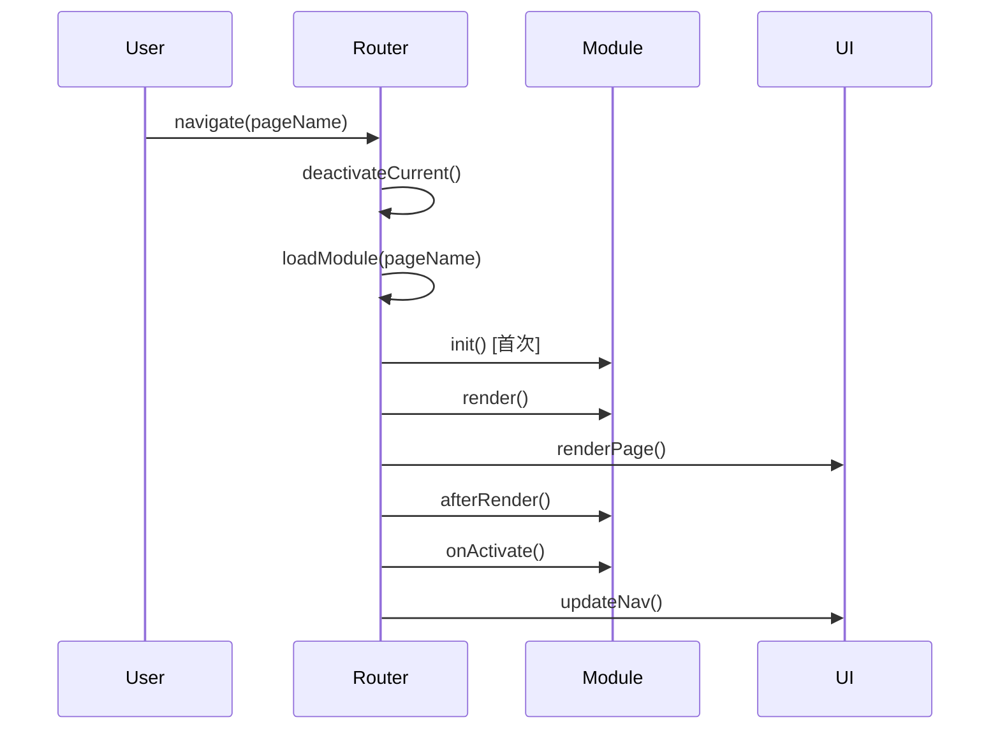
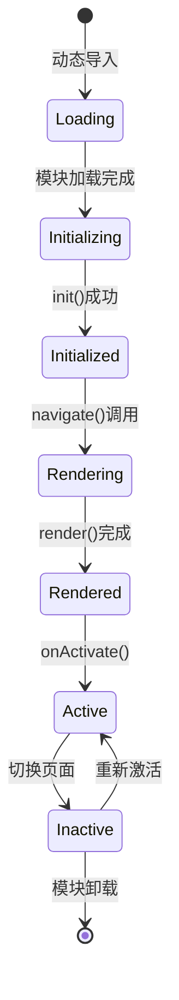

# 系统架构设计

本文档介绍ModuleWebUI的系统架构、设计理念和技术选型。

## 🏗️ 整体架构

### 架构图

```
┌─────────────────────────────────────────────────────────────┐
│                        用户界面层                             │
├─────────────────────────────────────────────────────────────┤
│   页面模块 A   │  页面模块 B   │   页面模块 C   │   页面模块 D    │
├─────────────────────────────────────────────────────────────┤
│                      应用核心层                               │
│  ┌─────────┐  ┌─────────┐  ┌─────────┐  ┌─────────┐         │
│  │ Router  │  │   UI    │  │  I18n   │  │ Overlay │         │
│  │ 路由管理 │  │ UI管理   │  │ 国际化  │   │ 覆盖层   │         │
│  └─────────┘  └─────────┘  └─────────┘  └─────────┘         │
├─────────────────────────────────────────────────────────────┤
│                      基础设施层                               │
│  ┌─────────┐  ┌─────────┐  ┌─────────┐  ┌─────────┐         │
│  │ 缓存系统 │  │ 事件系统 │   │ 模块加载 │  │ 性能优化 │          │
│  └─────────┘  └─────────┘  └─────────┘  └─────────┘         │
├─────────────────────────────────────────────────────────────┤
│                      构建工具层                               │
│                Vite + 代码分割 + 资源优化                      │
└─────────────────────────────────────────────────────────────┘
```

### 核心组件

#### 1. App (应用主类)
- **职责**: 应用生命周期管理、主题控制、初始化协调
- **特点**: 单例模式，全局状态管理
- **关键方法**: `init()`, `setTheme()`, `finishLoading()`

#### 2. Router (路由管理器)
- **职责**: 页面导航、模块加载、生命周期管理
- **特点**: 智能缓存、懒加载、错误处理
- **关键方法**: `navigate()`, `loadModule()`, `renderPage()`

#### 3. UI (界面管理器)
- **职责**: 界面元素控制、响应式布局、用户交互
- **特点**: 自适应布局、动态按钮管理
- **关键方法**: `registerPageActions()`, `updateNav()`, `showLanguageSelector()`

#### 4. I18n (国际化系统)
- **职责**: 多语言支持、动态翻译、语言切换
- **特点**: 运行时切换、自动应用、扩展性强
- **关键方法**: `translate()`, `setLanguage()`, `applyTranslations()`

## 🔧 设计理念

### 1. 模块化设计

**页面即模块**: 每个页面都是独立的模块，具有完整的生命周期。

```javascript
// 标准页面模块结构
export const PageModule = {
    // 配置信息
    config: null,
    
    // 生命周期钩子
    async init(ui) { /* 初始化 */ },
    render() { /* 渲染 */ },
    async afterRender() { /* 渲染后 */ },
    async onActivate() { /* 激活 */ },
    async onDeactivate() { /* 停用 */ },
    
    // 预加载支持
    async preload() { /* 预加载 */ },
    async getHTML() { /* 获取HTML */ }
};
```

**优势**:
- 🔄 **热插拔**: 模块可以独立开发、测试、部署
- 🎯 **职责清晰**: 每个模块只关注自己的功能
- 🚀 **按需加载**: 只加载当前需要的模块
- 🔧 **易于维护**: 模块间解耦，便于维护和扩展

### 2. 配置驱动

**集中配置管理**: 所有页面模块的基础信息都在 `main.js` 中集中管理。

```javascript
const PAGE_MODULE_CONFIGS = {
    status: {
        id: 'status',
        name: '状态',
        icon: 'dashboard',
        module: 'StatusPage',
        i18n_key: 'NAV_STATUS',
        order: 1
    }
    // ... 其他配置
};
```

**优势**:
- 📋 **统一管理**: 所有配置信息集中管理
- 🔄 **动态扩展**: 支持运行时添加/移除模块
- 🎨 **灵活配置**: 图标、顺序、名称等都可配置
- 🌍 **国际化友好**: 内置多语言支持

### 3. 事件驱动

**松耦合通信**: 模块间通过事件系统进行通信。

```javascript
// 发送事件
const event = new CustomEvent('dataUpdated', {
    detail: { data: newData }
});
document.dispatchEvent(event);

// 监听事件
document.addEventListener('dataUpdated', (event) => {
    this.handleDataUpdate(event.detail.data);
});
```

**系统事件**:
- `languageChanged`: 语言切换
- `translationsLoaded`: 翻译加载完成
- `resize`: 窗口大小变化

### 4. 性能优先

**多层缓存策略**:

```javascript
// 1. 模块缓存 - 避免重复加载
window.app.router.cache

// 2. 内容缓存 - 缓存渲染结果
window.app.cache

// 3. 预加载缓存 - 后台预加载
window.app.preloadCache

// 4. 本地存储缓存 - 持久化数据
localStorage
```

**代码分割**: 使用Vite的动态导入实现按需加载。

```javascript
// 动态导入页面模块
const module = await import(`@pages/${name}.js`);
```

## 🔄 数据流

### 页面导航流程



### 模块生命周期



## 🎨 UI架构

### 响应式设计

**断点策略**:
- **移动端**: < 768px
- **桌面端**: ≥ 768px

**自适应布局**:
```javascript
// 根据屏幕尺寸调整布局
const isLandscape = window.innerWidth >= 768;

if (isLandscape) {
    // 桌面端：侧边栏显示操作按钮
    this.renderActions(sidebarContainer, actions);
} else {
    // 移动端：顶部显示操作按钮
    this.renderActions(headerContainer, actions);
}
```

### 主题系统

**CSS变量驱动**:
```css
:root {
    --primary: #1976d2;
    --background: #ffffff;
    --surface: #f5f5f5;
    --text: #333333;
}

[data-theme="dark"] {
    --primary: #90caf9;
    --background: #121212;
    --surface: #1e1e1e;
    --text: #ffffff;
}
```

**动态切换**:
```javascript
setTheme(theme) {
    document.documentElement.setAttribute('data-theme', theme);
    localStorage.setItem('theme', theme);
    this.updateThemeIcons();
}
```

## 🌍 国际化架构

### 翻译文件结构

```
src/assets/translations/
├── zh.json          # 中文
├── en.json          # 英文
└── ru.json          # 俄文
```

### 翻译应用机制

**HTML自动翻译**:
```html
<h1 data-i18n="TITLE_KEY">默认标题</h1>
<input data-i18n-placeholder="SEARCH_PLACEHOLDER" placeholder="搜索...">
```

**JavaScript动态翻译**:
```javascript
const text = I18n.translate('KEY', '默认文本');
```

### 语言切换流程

1. 用户选择语言
2. 加载对应翻译文件
3. 更新 `I18n.currentLang`
4. 触发 `languageChanged` 事件
5. 自动应用翻译到页面
6. 更新导航标签和页面标题

## 🚀 构建架构

### Vite配置特性

```javascript
// vite.config.js 关键配置
export default defineConfig({
    // 路径别名
    resolve: {
        alias: {
            '@': path.resolve(__dirname, 'src'),
            '@assets': path.resolve(__dirname, 'src/assets'),
            '@components': path.resolve(__dirname, 'src/components'),
            '@pages': path.resolve(__dirname, 'src/pages')
        }
    },
    
    // 构建优化
    build: {
        rollupOptions: {
            output: {
                manualChunks: {
                    vendor: ['@components/modal.js'],
                    i18n: ['./src/i18n.js']
                }
            }
        }
    }
});
```

### 代码分割策略

1. **页面级分割**: 每个页面模块独立打包
2. **组件级分割**: 大型组件按需加载
3. **工具库分割**: 第三方库单独打包
4. **资源分割**: CSS、图片等静态资源优化

## 🔧 扩展性设计

### 添加新页面模块

1. **创建模块文件**: `src/pages/newpage.js`
2. **注册配置**: 在 `main.js` 中添加配置
3. **添加样式**: `src/assets/css/pages/newpage.css`
4. **添加翻译**: 在翻译文件中添加对应键值

### 自定义组件

```javascript
// src/components/my-component.js
export class MyComponent {
    constructor(options) {
        this.options = options;
    }
    
    render() {
        return `<div class="my-component">${this.options.content}</div>`;
    }
}
```

### 插件系统（未来扩展）

```javascript
// 插件接口设计
class Plugin {
    constructor(app) {
        this.app = app;
    }
    
    install() {
        // 插件安装逻辑
    }
    
    uninstall() {
        // 插件卸载逻辑
    }
}
```

## 📊 性能指标

### 关键性能指标

- **首屏加载时间**: < 1s
- **页面切换时间**: < 200ms
- **内存使用**: < 50MB
- **包大小**: 主包 < 500KB

### 优化策略

1. **预加载**: 后台预加载非当前页面
2. **缓存**: 多层缓存减少重复加载
3. **压缩**: Gzip/Brotli压缩
4. **CDN**: 静态资源CDN加速
5. **懒加载**: 按需加载模块和资源

## 🔒 安全考虑

### XSS防护

- 所有用户输入都进行转义
- 使用 `textContent` 而非 `innerHTML`
- CSP (Content Security Policy) 配置

### 数据安全

- 敏感数据不存储在前端
- API调用使用HTTPS
- 本地存储数据加密

## 🧪 测试策略

### 单元测试

- 核心类和方法的单元测试
- 工具函数测试
- 组件渲染测试

### 集成测试

- 页面导航流程测试
- 模块生命周期测试
- 国际化功能测试

### E2E测试

- 用户操作流程测试
- 跨浏览器兼容性测试
- 性能回归测试

通过这种架构设计，ModuleWebUI实现了高度的模块化、可扩展性和性能优化，为开发者提供了一个强大而灵活的页面管理系统。